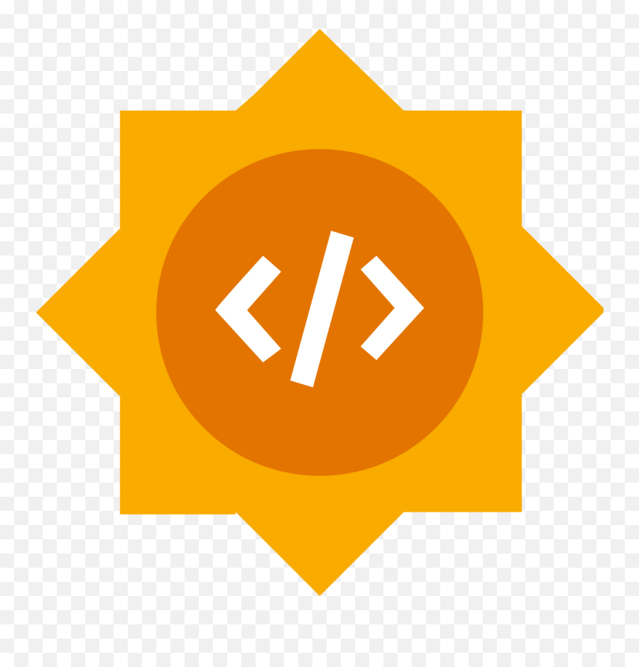
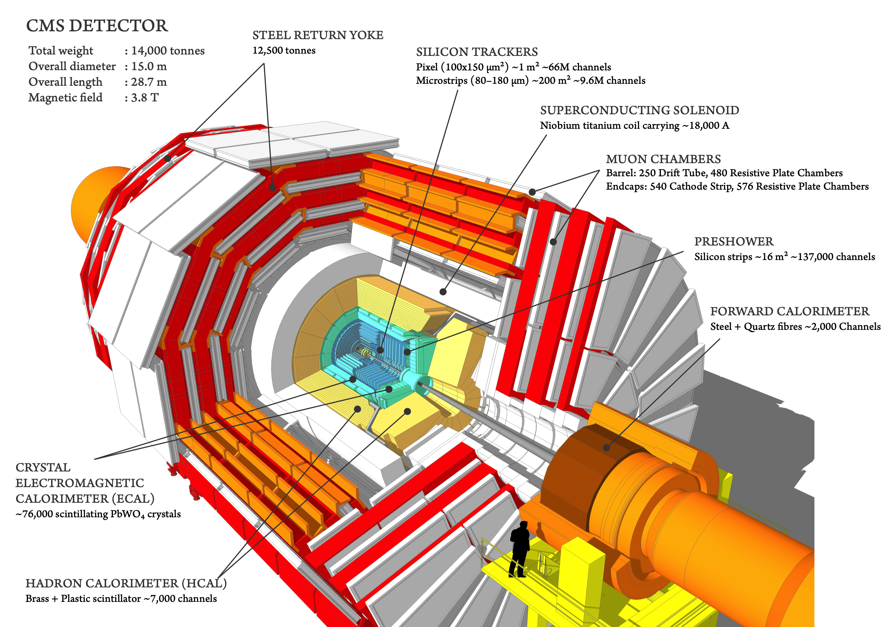

# Event Classification with Masked Transformer Autoencoders 

LorentzParT, a Particle Transformer model with LGATr's EquiLinear layers for jet physics tasks on JetClass dataset, including jet classification and masked particle reconstruction with momentum-conservation losses.

## Overview

High-energy physics jets are complex objects composed of many particles. This repo provides implementations of Particle Transformer-based models and training utilities to tackle:
- Jet classification (multi-class) using attention over per-particle inputs
- Masked particle reconstruction (predicting a masked particle’s kinematics) with conservation-aware losses


*Cutaway diagram of CMS detector (retrieved from https://cds.cern.ch/record/2665537/files/)*

Core components:
- Models: `LorentzParT`, a `ParticleTransformer` with `EquiLinear` layers from `LGATr`.
- Engine: Training/eval loops, logging, checkpointing (see `src/engine/trainer.py`)
- Configs: YAML-driven experiment config (see `configs/`)
- Datasets: Utilities for loading the ROOT files from JetClass dataset (see `src/utils/data`)

## Get Started

### Prerequisites

- Python 3.13
- Git

### Installation

1. **Clone the repository**

    ```bash
    git clone <repository-url>
    cd Hybrid_Transformer_Thanh_Nguyen
    ```

2. **Create and activate a virtual environment**

    ```bash
    python -m venv venv

    # On Windows
    venv\Scripts\activate

    # On macOS/Linux
    source venv/bin/activate
    ```

3. **Install dependencies**

    ```bash
    pip install -r requirements.txt
    ```

4. **Install PyTorch (GPU or CPU):**

    See: https://pytorch.org/get-started/locally/

## Data

The JetClass dataset is publicly available: https://zenodo.org/records/6619768

Install and place the ROOT files under `./data/` in split folders. Example:

```
data/
├── train_100M/
├── val_5M/
│   ├── HToBB_120.root
│   ├── ...
│   └── ZToQQ_124.root
└── test_20M/
```

Utilities to read ROOT and build numpy arrays/live datasets are under `src/utils/data`. Per-particle features are typically `[pT, eta, phi, energy]`. Some configs use a mask to hide one particle during training and reconstruct it.

## Configuration

Experiments are defined in YAML. See `configs/train_ParT.yaml` (excerpt):

```yaml
model:
    num_classes: 10
    embed_dim: 128
    num_layers: 8
    max_num_particles: 128
    num_particle_features: 4
    mask: True  # enable masked-particle reconstruction mode
    inference: False

train:
    batch_size: 128
    criterion:
        name: 'conservation_loss'
        kwargs:
            loss_coef: [0.25, 0.25, 0.25, 0.25]
            reduction: 'mean'
    optimizer:
        name: 'adam'
        kwargs: {lr: 0.0001}
    scheduler:
        name: exponential_lr
        kwargs: {gamma: 0.95}
    num_epochs: 20
    logging_dir: logs
```

Model and training configs are parsed and fed into the trainers.

## Train and Evaluate

Two lightweight CLI scripts are provided under `scripts/` and use YAML experiment definitions:

- Training: `scripts/train.py` — trains a `LorentzParT` model defined by the YAML config and saves logs/weights
- Evaluation: `scripts/evaluate.py` — loads a trained model and runs evaluation/visualization on a test split

Both scripts support single-GPU / CPU runs and will spawn processes for multi-GPU (DDP) when multiple CUDA devices are visible.

Train usage (example):

```bash
# single-GPU or CPU
python -m scripts.train \
    --config-path ./configs/train_LorentzParT.yaml \
    --checkpoint-path /logs/LorentzParT/checkpoints/run_01.pt \
    --train-data-dir ./data/train_100M \
    --val-data-dir ./data/val_5M
```

Key flags for `scripts/train.py`:
- `--config-path`: Path to the YAML experiment (default: `./configs/train_LorentzParT.yaml`)
- `--checkpoint-path`: Optional trainer checkpoint to resume from
- `--train-data-dir`: Directory with training ROOT files
- `--val-data-dir`: Directory with validation ROOT files

Notes:
- The script reads `model` and `train` sections from the YAML and constructs a `LorentzParT` model and a `Trainer` or `MaskedModelTrainer` depending on `model.mask`.
- For multi-GPU runs the script will call `torch.multiprocessing.spawn` using `torch.cuda.device_count()` processes.

Evaluate usage (example):

```bash
# single-GPU or CPU
python -m scripts.evaluate \
    --config-path ./configs/train_LorentzParT.yaml \
    --best-model-path ./logs/LorentzParT/best/run_01.pt \
    --test-data-dir ./data/test_20M
```

Key flags for `scripts/evaluate.py`:
- `--config-path`: Path to the YAML experiment (default: `./configs/train_LorentzParT.yaml`)
- `--best-model-path`: Path to saved best model weights used for evaluation
- `--test-data-dir`: Directory with test ROOT files

Notes:
- `evaluate.py` builds a `Trainer`/`MaskedModelTrainer` using the same YAML and will call `trainer.evaluate(...)`.
- For classification mode (`model.mask == False`) the script will call `trainer.evaluate` with plotting helpers such as `plot_roc_curve` and `plot_confusion_matrix` (see `src/utils/viz.py`).
- For masked/self-supervised mode the script uses `plot_particle_reconstruction` to visualize reconstructions.
- The evaluation script also supports multi-GPU via DDP spawn.

## Model and Losses

- `src/models/lorentz_part.py`: `ParticleTransformer` backbone and heads combined with `EquiLinear` layers from `LGATr`.
- `src/loss/`: Losses including `ConservationLoss` for masked reconstruction.

## Notebooks

See `notebooks/01_LorentzParT_demo.ipynb` for a quick, interactive demonstration of loading data and running the model.

## Testing

Run the test suite:

```bash
python -m pytest tests/ -v
```

## Project Structure

```
Hybrid_Transformer_Thanh_Nguyen/
├── src/
│   ├── configs/           # Dataclasses and loaders for YAML configs
│   ├── engine/            # Training/evaluation engine
│   ├── loss/              # Loss functions and registry
│   ├── models/            # Particle Transformer and variants
│   ├── optim/             # Optimizers/schedulers registries
│   └── utils/             # Callbacks, metrics, data, viz helpers
├── scripts/               # CLI tools: train/evaluate
├── tests/                 # Unit tests
├── logs/                  # Runs: best weights and CSV logs
├── data/                  # ROOT files (train/val/test splits)
└── assets/                # Figures and demo assets
```